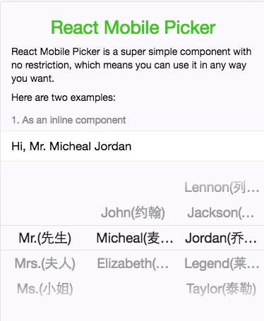

# React Mobile Picker2




## Install

```
npm install react-mobile-picker2 --save
```

## Usage

### ES6

```javascript
import Picker from 'react-mobile-picker2';
```

### CommonJS

```javascript
var Picker = require('react-mobile-picker2');
```

## Props

| Property name | Type | Default | Description |
| ------------- | ---- | ------- | ----------- |
| optionGroups | Object | N/A | array `[{key: value,...}, {key: value,...}, ...]`  |
| valueGroups | Object | N/A | Selected value pairs as `{name1: value1, name2: value2}`. |
| onChange(name, value) | Function | N/A | Callback called when user pick a new value. |
| itemHeight | Number | 36 | Height of each item (that is each option). In `px`. |
| height | Number | 216 | Height of the picker. In `px`. |

改变optionGroups的格式为数组

```js
optionGroups = [
	{
	  name: 'title',
	  text: ['Mr.(先生)', 'Mrs.(夫人)', 'Ms.(小姐)', 'Dr.'],
	  value: ['Mr.', 'Mrs.', 'Ms.', 'Dr.'],
	  label: '',
	},
	
    {
      name: 'firstName',
      text: ['John(约翰)', 'Micheal(麦克)', 'Elizabeth(伊丽莎白)'],
      value: ['John', 'Micheal', 'Elizabeth'],
      label: '',
    }
]

valueGroups = {
	title: 'Mr.',
	firstName: 'Micheal',
}
```
```name``` 对应valueGroups里面的key<br/>
```text``` 为要显示的文字<br/>
```value``` 为实际要传的值<br/>
```label``` 额外的文字，显示在text的后面<br/>

## Getting Started


```javascript
import React, {Component} from 'react';
import Picker from 'react-mobile-picker2';

class App extends Component {
  constructor(props) {
    super(props);
    this.state = {
      valueGroups: {
        title: 'Mr.',
        firstName: 'Micheal',
        secondName: 'Jordan'
      }, 
      optionGroups: [
        {
          name: 'title',
          text: ['Mr.(先生)', 'Mrs.(夫人)', 'Ms.(小姐)', 'Dr.'],
          value: ['Mr.', 'Mrs.', 'Ms.', 'Dr.'],
          label: '',
        },
        {
          name: 'firstName',
          text: ['John(约翰)', 'Micheal(麦克)', 'Elizabeth(伊丽莎白)'],
          value: ['John', 'Micheal', 'Elizabeth'],
          label: '',
        },
        {
          name: 'secondName',
          text: ['Lennon(列侬)', 'Jackson(杰克逊)', 'Jordan(乔丹)', 'Legend(莱亨德)', 'Taylor(泰勒)'],
          value: ['Lennon', 'Jackson', 'Jordan', 'Legend', 'Taylor'],
          label: '',
        }
      ]
    };
  }

  // Update the value in response to user picking event
  handleChange = (name, value) => {
    this.setState(({valueGroups}) => ({
      valueGroups: {
        ...valueGroups,
        [name]: value
      }
    }));
  };

  render() {
    const {optionGroups, valueGroups} = this.state;

    return (
      <Picker
        optionGroups={optionGroups}
        valueGroups={valueGroups}
        onChange={this.handleChange} />
    );
  }
}
```

## More Examples

```
git clone this repo
npm install
npm start
point your browser to http://localhost:8000
```

## License

MIT.
